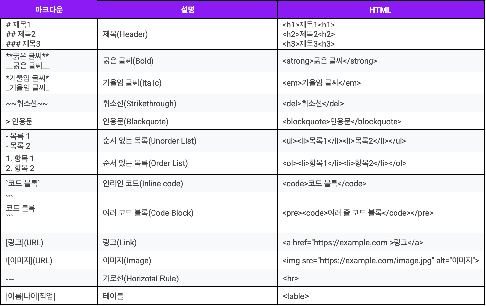

# 마크다운 문법

## Markdown이란?

```
일반 텍스트 기반의 경량 마크업 언어로 서식이 있는 문서를 작성하는데 사용되며 일반 마크업 언어에 비해 문법이 쉽고 간단한것이 특징이다.
HTML 및 RTF 등 서식 문서로 쉽게 변환이 되기 때문에 README.md 등의 게시글로 많이 사용됨
```

> 출처 [위키백과](https://ko.wikipedia.org/wiki/%EB%A7%88%ED%81%AC%EB%8B%A4%EC%9A%B4)

## Markdown 장/단점

1. **장점**

- 문법이 간결하고 쉬움
- 별도의 도구 없이 작성이 가능함
- 다양한 형태로 변환이 가능함
- Text 형식이므로 용량이 적고 버전 관리가 용이함
- 지원 가능한 플랫폼과 프로그램이 다양함

2. **단점**

- 표준이 존재하지 않아 사용자마다 문법이 상이할 수 있음
- 모든 HTML 마크업을 대신하지 못함

## Markdown vs HTML



## Markdown/HTML 예시

### 제목(Header)

책의 목차같은 개념으로 Markdown은 `#`으로 표현하고 HTML에서는 `<h1>~<h6>`으로 표현함

|  마크다운 |  HTML |
| ----------------------------------- | ------------------------------------- |

---

### 글씨(Font)

글씨(Text)의 표현을 줄 수 있으며 Markdown은 `두껍게(**)`, `취소선(~~)`, `기울림(*)`으로 표현하며 <br>
HTML의 경우 `두껍게<strong>`, `취소선<del>`, `기울림<em>`으로 표현함

|  마크다운 |  HTML |
| --------------------------------- | ------------------------------- |

---

### 인용문(Blockquote)

다른 출처로부터 인용된 글을 표현할 때 쓰이며 Markdown은 `>`으로 표현하며 HTML은 `<blockqoute>`로 표현함

|  마크다운 |  HTML |
| --------------------------------------- | ------------------------------------- |

---

### 순서가 없는 목록(Undorder List)

주로 세부 내용을 나타낼 때 표현하는 문법으로 Markdown에서는 `- 목록`으로 표현하고 HTML에서는 `<ul><li>목록<li></ul>`으로 표현함

|  마크다운 |  HTML |
| ---------------------------------------- | -------------------------------------- |

---

### 순서가 있는 목록(Order List)

'순서가 없는 항목'과 유사하게 쓰이며 주로 순서를 나타낼때(메뉴얼, 레시피 등) 사용함, Markdown은 `1. 내용 2. 내용`으로 표현하며 <br>
HTML의 경우 `<ol><li>내용</li></ol>`을 여러개 사용하여 `내용` 부분을 수정함

|  마크다운 |  HTML |
| --------------------------------------- | ------------------------------------- |

---

### Code Block(Inline)

주로 한줄의 소스코드 또는 명령어를 표현할 떄 쓰이며 특정 문장으 강조할때 쓰이기도 함. Markdown은 ``으로 표현하며 <br>
HTML은`<code>내용</code>`으로 표현함
_md.png>) 마크다운 | _html.png>) HTML
---| ---|

---

### Code Block(여러개의 코드 블럭)

여러줄의 소스코드, 명령어를 표현할 떄 쓰임 Markdown은 백쿼트로 표현하며 HTML의 경우 `<pre><code>내용</code></pre>`로 표현함<br>
`마크다운의 코드 블럭 표현 방법은 아래 이미지 참고`
 마크다운 |  HTML
---| ---|

---

### 링크(Link)

주로 컨텐츠에 참고 또는 직접적인 연관이 있는 `외부 페이지`로 이동하기 위해 쓰이며 Markdown은 `` <br>
HTML의 경우 `<a href=URL>페이지명</a>`로 표현함
 마크다운 |  HTML
---| ---|

---

### 이미지(Image)

이미지 파일을 노출시키기 위한 문법으로 Markdown은 ``으로 표현하며 HTML의 경우 ``로 표현함
Markdown 문법 사용 시 이미지를 첨부한 후 그 아래 라인에 `---| ---| ---|` 를 추가하면 이미지가 나란히 정렬됨
 마크다운 |  HTML |  HTML 이미지
---| ---| ---|

---

### 가로선

컨텐츠(내용)간 영역을 구분하기 위한 문법으로 Markdown은 `----`, HTML은 `<hr>`로 표현함
 마크다운 |  HTML
---| ---|

---

### Table

웹 브라우저상에 표를 표현하기 위한 문법으로 Markdown 및 HTML은 아래 이미지를 참고

|  마크다운 |  HTML |
| ---------------------------------- | -------------------------------- |
