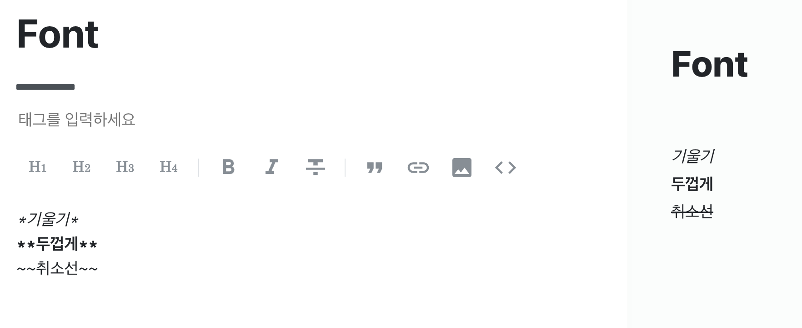

# 마크다운 문법

## Markdown이란?

```
일반 텍스트 기반의 경량 마크업 언어로 서식이 있는 문서를 작성하는데 사용되며 일반 마크업 언어에 비해 문법이 쉽고 간단한것이 특징이다.
HTML 및 RTF 등 서식 문서로 쉽게 변환이 되기 때문에 README.md 등의 게시글로 많이 사용됨
```

> 출처 [위키백과](https://ko.wikipedia.org/wiki/%EB%A7%88%ED%81%AC%EB%8B%A4%EC%9A%B4)

## 마크다운 장/단점

1. **장점**

- 문법이 간결하고 쉬움
- 별도의 도구 없이 작성이 가능함
- 다양한 형태로 변환이 가능함
- Text 형식이므로 용량이 적고 버전 관리가 용이함
- 지원 가능한 플랫폼과 프로그램이 다양함

2. **단점**

- 표준이 존재하지 않아 사용자마다 문법이 상이할 수 있음
- 모든 HTML 마크업을 대신하지 못함

## 마크다운 사용법

### 1. 제목(Header)

HTML의 `<h1> ~ <h6>`에 해당되며 표기는 아래와 같이 할 수 있음

```
# Header1
## Header2
### Header3
#### Header4
##### Header5
###### Header6
```

```
실행 결과(플랫폼 : velog)
```


### 2. 폰트

텍스트에 효과를 주는 문법으로 HTML의 `<strong>`(두껍게), `<em>`(기울기), `<del>`(취소선)을 사용할 수 있으며 표기법은 아래와 같음

```
실행 결과
```


